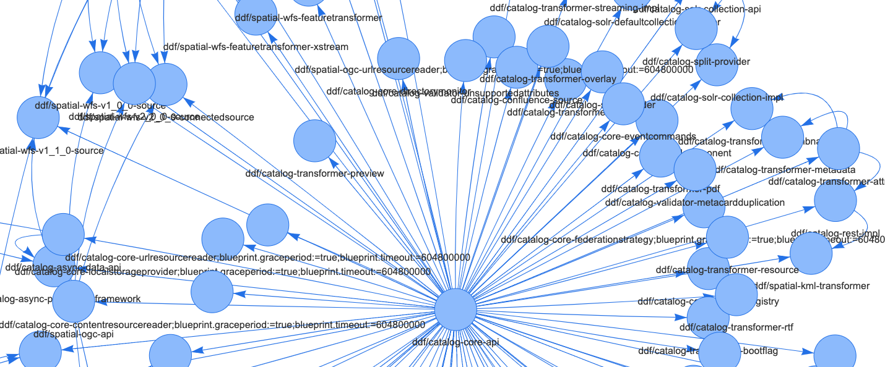

# OSG-Eyes
A CLI toolkit for working with dependency data.



## Quickstart

Review the following to get up and running quickly.

### Setup

Ensure JDK 8 or higher is available on your system and `java` is on your `PATH`. Download and 
explode the release zip. Run the following to start the CLI, adjusting for path differences if
necessary:
```
java -jar osgeyes-dist-VERSION/osgeyes-VERSION.jar
```

Once the CLI has loaded, run the following two commands first. Don't forget to adjust for 
path differences if necessary.
```
(index-load "osgeyes-dist-VERSION/index-ddf_2_19_5.edn")
(load-file "osgeyes-dist-VERSION/selections.clj")
```

#### When the graph index needs to be built manually

If you will be scanning new repositories to generate their dependency graphs instead of only
leveraging the provided index EDN file, first ensure that all cloned repositories (DDF, Alliance,
etc.) are in the same parent directory. Then verify either one of the following:
1. You ran `java -jar APP` from where your cloned repositories live; if DDF lives in `~/repos/ddf/`
then ensure your working directory is `~/repos/` before you start the app.
1. Alternatively, you set the `repos.home` property when starting the CLI, which looks like 
`java -Drepos.home=/path/to/cloned/repos -jar APP`.

Be sure to account for pathing differences to `APP`, the path to the OSG-Eyes executable jar. This
also applies for the path arguments to the `index-load` and `load-file` commands. 

### Gaining insights into dependencies

The purpose and value of this tool is to get a rough, high-level view of which components depend
on each other. This information can help inform refactoring decisions, component removal, and better
separation of concerns across repositories. The two fundamental operations that this tool provides to
support those goals are the following:
1. `(list-edges SELECTION OPTIONS)`
1. `(draw-graph SELECTION)`

Run `(draw-graph [:node "ddf/.*"])` to generate and open an interactive graph of DDF nodes within
the default browser. There is a lot of information on screen. Filtering the data to get a proper,
bite-sized view of the bigger picture is critical.

#### Graphing and listing dependencies by building selections

Graph nodes directly map to bundle artifacts and are named as follows: 
```
REPO-QUALIFIER/BUNDLE-SYMBOLIC-NAME
```

The canonical data structure is just a list of edges that claim who depends on what - plus any 
additional information that describes the edges. Generating a graph or listing edges is; fundamentally, 
just a filter operation on the edge list. You filter by defining a `SELECTION`. Selections are just 
vectors with regex constraints on certain fields of a graph edge, like so:
```
[CRITERIA REGEX-STRING]
```

`CRITERIA` is just a name that represents one or more fields that need to match the compiled 
`REGEX-STRING`. Note that criteria always  start with `:` - no exceptions.
Selecting edges that only concern DDF looks like the following, where a regex
against node names targets the `REPO-QUALIFIER` part of the name while not imposing constraints
on the `BUNDLE-SYMBOLIC-NAME` portion:
```
[:node "ddf/.*"]
```

Alternatively, to only select edges that are running _towards_ (that depend on) DDF, change the
criteria. This ends up widening the selection by a large margin because now any node from any
of the scanned repositories will show up if it has a connection to DDF:
```
[:to "ddf/.*"]
```

The opposite can be achieved, but it should only return nodes within DDF otherwise we have much 
bigger problems:
```
[:from "ddf/.*"]
```

It follows that a simple wildcard selection could look like `[:to ".*"]` or `[:from ".*"]` or 
`[:node ".*"]` - the criteria matters less than the fact that some test has been provided that will
evaluate to `true` for all edges that are being filtered, thus nothing will get filtered
out. Good luck making any sense of this in the browser, though. It's very noisy and very CPU hungry.

Selecting edges that only concern DDF **AND** only bundles with "spatial" in the symbolic name 
looks like this:
```
[:node "ddf/.*" :node ".*spatial.*"]
```

**OR** relationships are not currently supported across different search criteria but they can get 
baked into the regex for similar effect:
```
[:node "ddf/.*|alliance/.*" :node ".*spatial.*|.*catalog-core.*"]
```

The above selection guarantees the resultant edge list only includes edges where both nodes:
```
(belong to DDF or Alliance) AND (belong to spatial or catalog-core by naming convention only)
```

There should be enough power here to compose useful-enough selections, even though certain 
highly specific selections that involve **OR**'ing across different `CRITERIA` cannot be built yet. 

#### Flexibility and naming selections

You can nest selections.
```
[[:node "regex1" :node "regex2"][:cause "regex3" :type "regex4"]]
```

If you find yourself using a selection often, add it to the provided 
`osgeyes-dist-VERSION/selections.clj` file, following the structure already laid out in that file.
```
(def NAME-OF-SELECTION SELECTION-VALUE)
(def only-ddf [:node "ddf/.*"])
```

Leveraging `selections.clj` enables autocomplete and greatly enhanced readability. Most selection 
names are prefixed with `only-` by convention.
```
[only-ddf only-custom :cause "regex1"]
```

As long as the final result can be smashed down to a single vector with even size and proper 
criteria-regex alternating semantics, it'll work. Note that **you'll need to call** 
`(load-file "osgeyes-dist-VERSION/selections.clj")` **again to see changes take effect**.

#### Supported criteria

It is important to note that **no existing criteria (as of now) supports filtering the graph by 
connectivity**; that's not how selections work currently. All existing criteria simply filter
edges according to regular expression matches against string properties for a particular edge.

Supported criteria with format `REPO-QUALIFIER/BUNDLE-SYMBOLIC-NAME`:
```
[:node X] - shorthand for [:from X :to X]
[:from X] - source of the edge must match X
[:to X]   - destination of the edge must match X
```

Supported criteria with either `bundle/package` or `bundle/service`:
```
[:type X] - type of the edge must match X
```

Supported criteria with either package name or service interface name:
```
[:cause X] - string that caused the connection must match X
```

#### Command reference

These are all the commands you can call. All caps refers to what the arguments are, not 
necessarily what a call looks like, similar to UNIX-flavor of cmdline reference.

**View the reference in the CLI**
```
(help)
```

**Initialization tasks**
```
(load-file PATH)
(index-load PATH)
(index-repos REPO_PATH_1 REPO_PATH_2 ...)
```

**Analysis tasks**
```
(list-edges SELECTION OPTIONS)
(draw-graph SELECTION)
```

**Convenience**
```
(open-repos-dir)
(open-tmp-dir)
(open-working-dir)
```

## Advanced

Most users can get by with a pre-built index. This next section exists for those who can't. 

### Generating an index from code repositories

Ensure all repositories have the version of the code checked out that intends to be
analyzed, and that the last build ran was against the repositories in that state. It is important
the data in Maven's `/target` directories accurately reflect the data to be analyzed. Once that
is done, index the desired repositories for analysis:
```
osgeyes=> (index-repos ddf)
1 repositories indexed:
{:manifests 433}
```

The `index-repos` command supports variadic arguments:
```
osgeyes=> (index-repos ddf alliance)
2 repositories indexed:
{:manifests 461}
```

There is only one index in application memory at any given time. After indexing or loading an EDN
file, all analysis commands operate on that index and the previous state is lost. To save a
generated index as an EDN file, run `(index-dump)` then `(open-tmp-dir)`. The index data is saved
to `viz-index.edn` in the system's temporary directory.

## For Developers & Contributors

The CLI app is just a Clojure REPL with a particular namespace serving as the application's set
of commands - all commands are just Clojure functions. 

### Helpful Clojure resources

- [Function Reference](https://clojuredocs.org/quickref)
- [Concatenation Semantics Reference](https://medium.com/@greg_63957/conj-cons-concat-oh-my-1398a2981eab)
- [Language Reference](https://clojure.org/reference/reader)
- [Namespaces Guide](https://clojure.org/guides/repl/navigating_namespaces)
- [Style Guide](https://github.com/bbatsov/clojure-style-guide)
- [Common Conventions](https://stackoverflow.com/questions/6709131/what-are-clojures-naming-conventions)
- [Maven Plugin](https://github.com/talios/clojure-maven-plugin/blob/develop/README.markdown)

### Project-specific resources

- [REPLy Source Files](https://github.com/trptcolin/reply/tree/master/src/clj/reply)
- [Regex Negation](https://stackoverflow.com/questions/8610743/how-to-negate-any-regular-expression-in-java/8611094#8611094)